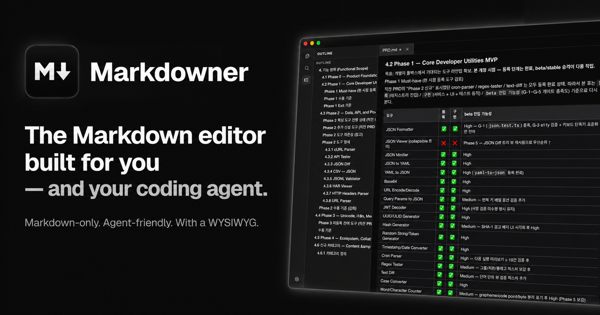

# Markdowner

<p align="center">
  
</p>

<p align="center">
  <a href="https://github.com/channprj/markdowner/releases/latest"></a>
  <a href="https://github.com/channprj/markdowner/releases"></a>
  <a href="./LICENSE"></a>
  
</p>

<p align="center">
  <a href="https://markdowner.chann.dev">Website</a>
  ·
  <a href="https://github.com/channprj/markdowner/releases/latest">Download</a>
  ·
  <a href="./README.ko.md">Korean README</a>
</p>

Markdowner is a local-first Markdown editor for macOS, built for people who want a polished writing surface without giving up plain `.md` files. It combines WYSIWYG editing, source editing, workspace navigation, and a Rust document core that keeps Markdown as the source of truth.

The app is also designed to work well as the editor that coding agents and command-line tools can open when they need a human to edit a buffer, review a note, or finish a commit message.

## Highlights

- **Markdown-native editing**: WYSIWYG, source editor, and split view all work against Markdown files rather than a proprietary document format.
- **Local desktop shell**: open files or folders, manage tabs, save safely, restore sessions, and handle files through the native macOS app.
- **Workspace navigation**: file tree, Quick Open, command palette, outline panel, workspace search, document stats, and recent documents.
- **Writing ergonomics**: find and replace, minimap, word wrap controls, wrap guide, focus mode, typewriter mode, table editing, code blocks, checklists, and image/link support.
- **Safer file writes**: atomic saves, dirty-close confirmation, read-only file handling, and external-change detection with reload/keep-local flows.
- **Customizable reading and editing**: built-in light/dark themes, system-theme following, imported CSS themes, editor font controls, table density, and code-block theme settings.
- **Agent-friendly CLI integration**: install the `mdner` command and set `EDITOR` / `VISUAL` so terminal tools can open Markdowner directly.
- **Release-aware app**: update checks read GitHub Releases, and the public release workflow builds a universal macOS DMG.

## Install

Markdowner currently ships for macOS.

Download the latest DMG from:

```text
https://github.com/channprj/markdowner/releases/latest
```

Or install the latest release from the terminal:

```bash
curl -fsSL https://raw.githubusercontent.com/channprj/markdowner/main/install.sh | bash
```

To install and launch immediately:

```bash
curl -fsSL https://raw.githubusercontent.com/channprj/markdowner/main/install.sh | MARKDOWNER_OPEN=1 bash
```

The installer downloads the latest matching `.dmg` asset, mounts it, copies `Markdowner.app` into `/Applications`, and clears the local quarantine attribute for the installed bundle.

> Markdowner uses ad-hoc signing for no-cost distribution today. Developer ID signing and notarization are planned, so macOS may still require manual approval from System Settings on first launch after a downloaded install.

## Quick Start

1. Launch Markdowner.
2. Open a Markdown file with `Cmd+O`, or open a folder with `Cmd+Shift+O`.
3. Switch modes with `Opt+1` for WYSIWYG, `Opt+2` for Editor, and `Opt+3` for Split View.
4. Use `Cmd+P` for Quick Open and `Cmd+Shift+P` for the command palette.
5. Save with `Cmd+S`.

Useful shortcuts:

| Action | Shortcut |
| --- | --- |
| Quick Open | `Cmd+P` |
| Command Palette | `Cmd+Shift+P` |
| Find in Current File | `Cmd+F` |
| Search in Workspace | `Cmd+Shift+F` |
| Toggle Sidebar | `Cmd+Shift+B` |
| Toggle Outline | `Cmd+Shift+D` |
| Toggle Focus Mode | `Cmd+Shift+J` |
| Toggle Typewriter Mode | `Cmd+Shift+Y` |
| Toggle Word Wrap | `Option+Z` |

## CLI Integration

Markdowner can install a small `mdner` launcher so command-line tools can open files or folders in the desktop app:

```bash
mdner README.md
mdner path/to/project
```

From the app, open **Settings** and use the CLI sections to:

- install or remove `/usr/local/bin/mdner`
- add a managed shell snippet for `EDITOR="mdner"` and `VISUAL="mdner"`
- verify whether the command is available on your shell `PATH`

This is useful with tools that spawn `$EDITOR` for commit messages, prompts, notes, or review buffers.

## Development

Markdowner is built with Tauri v2, React 19, Vite, TypeScript, Tiptap, CodeMirror 6, Tailwind CSS, and a Rust workspace.

Recommended local toolchain:

- Node.js 22+
- pnpm 10+
- Rust stable
- Xcode Command Line Tools on macOS

Install dependencies:

```bash
pnpm install
```

Run the desktop app in development mode:

```bash
pnpm tauri dev
```

The Vite dev server is pinned to `http://127.0.0.1:14238` with `strictPort` enabled so it does not silently attach to another local app.

## Build

Common commands:

```bash
pnpm build                         # type-check and build the frontend
pnpm build debug                   # debug Tauri build
pnpm build dmg                     # release DMG with ad-hoc signing
pnpm build universal dmg           # Apple Silicon + Intel universal DMG
pnpm build install                 # build and install to /Applications
pnpm build install open            # install, then launch the installed app
pnpm build:install:open            # package-script alias for install + open
pnpm build:mac:dmg                 # package-script alias for release DMG
pnpm build:mac:universal:dmg       # package-script alias for universal DMG
```

Install path overrides:

```bash
MARKDOWNER_INSTALL_PATH=~/Applications pnpm build install
pnpm build install -- --path ~/Applications
pnpm build install -- --no-build
pnpm build install -- --open
```

## Test

Run the main verification suite:

```bash
pnpm test
cargo test
```

Useful focused checks:

```bash
pnpm exec vitest run
bash scripts/build-and-install.test.sh
cargo test -p markdowner-core
pnpm exec tsc --noEmit
```

## Release

Markdowner uses the repo-root `VERSION` file and date-based versions in the form:

```text
MAJOR.YYMMDD.PATCH
```

Refresh the date/patch version locally:

```bash
pnpm bump refresh
```

Push a release bump from `main`:

```bash
pnpm bump refresh --push
```

That command syncs `VERSION` into `package.json`, `src-tauri/tauri.conf.json`, `src-tauri/Cargo.toml`, and `Cargo.lock`, commits those version files, and pushes to `main`.

The GitHub Actions release workflow then:

1. reads `VERSION`
2. installs the Node and Rust toolchains
3. syncs version metadata
4. builds a universal macOS DMG
5. creates the GitHub Release with `gh release create --generate-notes`
6. uploads the generated DMG asset

GitHub generates the release notes by comparing the new release with the previous tag.

## Repository Layout

```text
crates/markdowner-core/      Rust document model, Markdown round-trip logic, settings, workspace runtime
crates/markdowner-macos/     Earlier macOS reference crate and regression boundary
src/                         React/Vite desktop frontend
src-tauri/                   Tauri shell, Rust command bridge, updater, macOS integration
scripts/                     Build, install, version sync, and release helper scripts
docs/                        Architecture and Markdown coverage notes
```

## Current Status

Markdowner is usable today as a macOS desktop Markdown editor, with the core writing, navigation, settings, local build, and release paths in place.

Still planned:

- Developer ID signing and notarization
- Windows build, test, and release validation
- HTML/PDF/print export
- richer image asset workflows
- automated desktop E2E, screenshot regression, and accessibility gates

## Contributing

Issues and pull requests are welcome. For code changes, keep the scope tight, run the focused tests that cover your change, and include the relevant verification commands in the PR description.

## License

MIT. See [LICENSE](./LICENSE).
